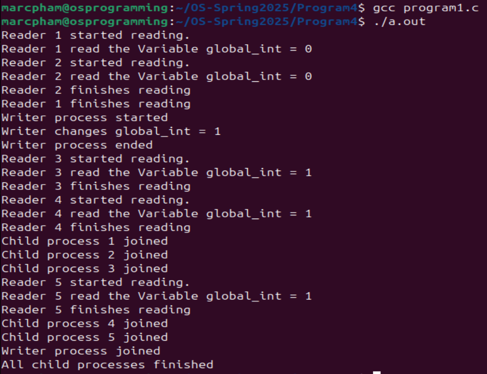

# Operating Systems: Programming 4
Name: Marc Pham  
CS5343 student must perform Program 1 only.
## Program 1
Program 1 asks us to write a C program to implement the readers-writer algorithm with multiple readers and one writer. `program1.c` starts by creating 2 reader processes, creating one writer process, and finally creating the last 3 reader processes. To synchronize the activity between each process, the program creates shared memory with two binary semaphores (`mutex` and `rw_mutex`), a variable to count the number of readers, and a `global_int` to read and write to.  
The reader processes use `rw_mutex` to keep writers from writing to `global_int` if there are readers still reading the variable. The writer process uses `rw_mutex` to write to the variable only if no other readers or writers are using the variable.

Looking at the snapshot (program1_output.png), we see that the program follows the main rules of the readers-writers problem. First, multiple reader processes can read the global variable `global_int` simultaneously, which is shown by Readers 1 and 2. Second, writer processes must have exclusive access to the data. In our output, we see that the Writer Process waits for both Readers 1 and 2 to finish before starting to write to the variable.

